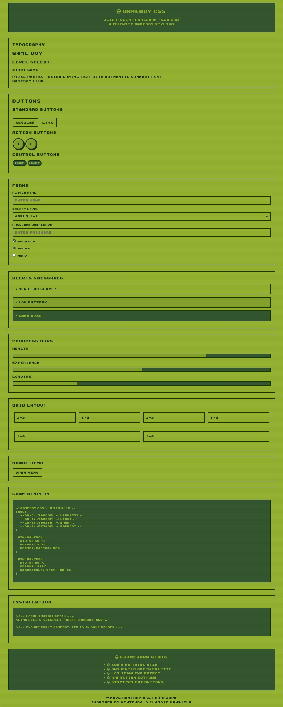

<div align="center">
  <h2>GameBoy CSS</h2>

  <a href="https://github.com/pruger/">Github</a>
</div>

GameBoy CSS: ***Retro GameBoy-style*** CSS framework


# About
GameBoy CSS is a minimalist CSS framework that captures the classic GameBoy aesthetic with its iconic green monochrome display, pixelated borders, and retro styling. It is designed to be simple, small, and easy to use.

### Features
* Tiny CSS framework with GameBoy aesthetic
* Authentic retro styling
* Simple and lightweight

### Font
This framework uses Press Start 2P from Google Fonts, which loads automatically. No additional font installation required.

**Credit:** Press Start 2P by [CodeMan38](https://fonts.google.com/specimen/Press+Start+2P)

### Installation
Local installation:
```
    <link rel="stylesheet" href="gameboy.css">
```

CDN installation
````
    <link rel="stylesheet" href="https://cdn.jsdelivr.net/gh/pruger/og-gameboy-css/gameboy.css">
````

### Usage
GameBoy CSS provides components with predefined GameBoy-style appearance. You will need to define your own layout. The framework uses Press Start 2P font automatically.

### Preview


### Demo
**[OG Gameboy CSS Demo](https://pruger.github.io/og-gameboy-css/)**
